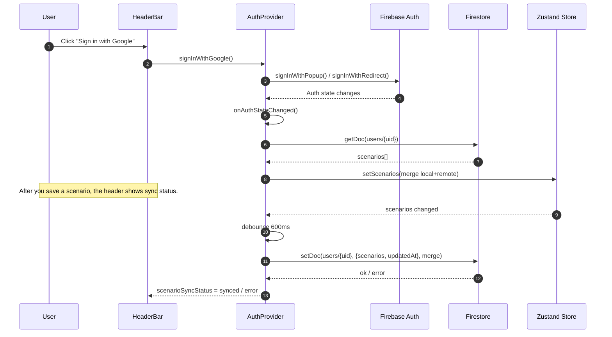
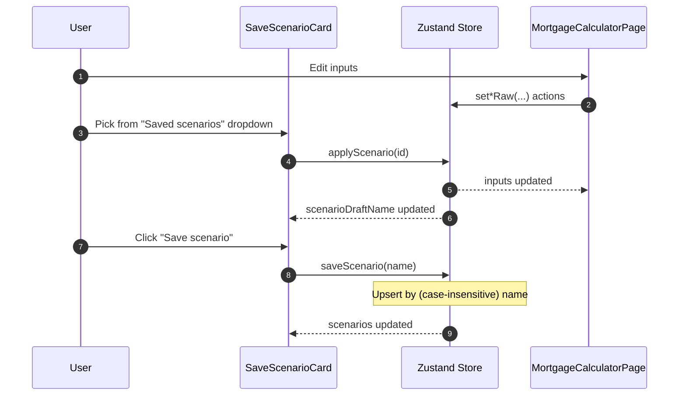
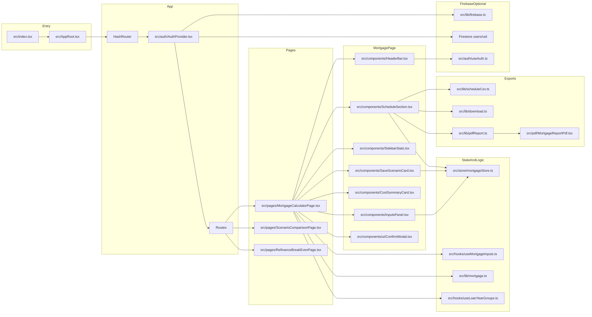
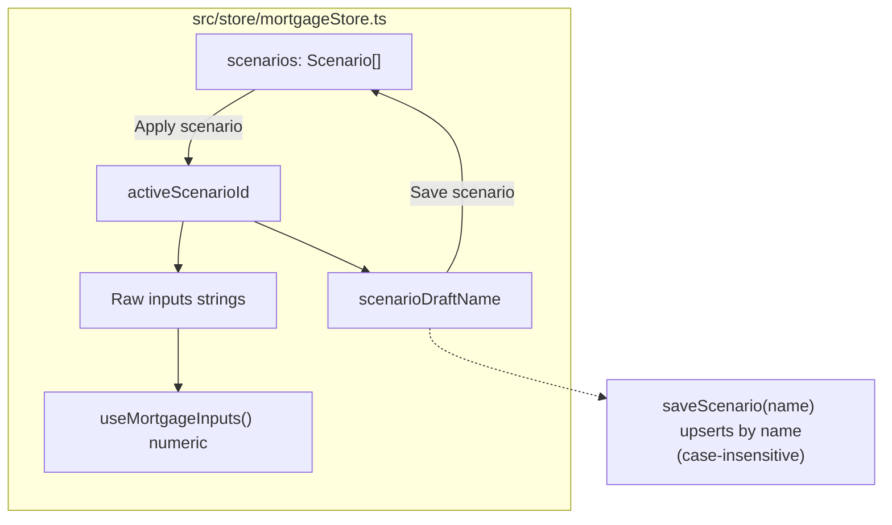

# Diagrams (Mermaid)

These diagrams reflect the current UX and component architecture.

Tip: GitHub renders Mermaid diagrams automatically in Markdown.

## UX – Sign-in and scenario sync (optional)

## UX – Save / apply scenario (no page changes)

## App – Component / module map

## Mortgage scenario state (store)

